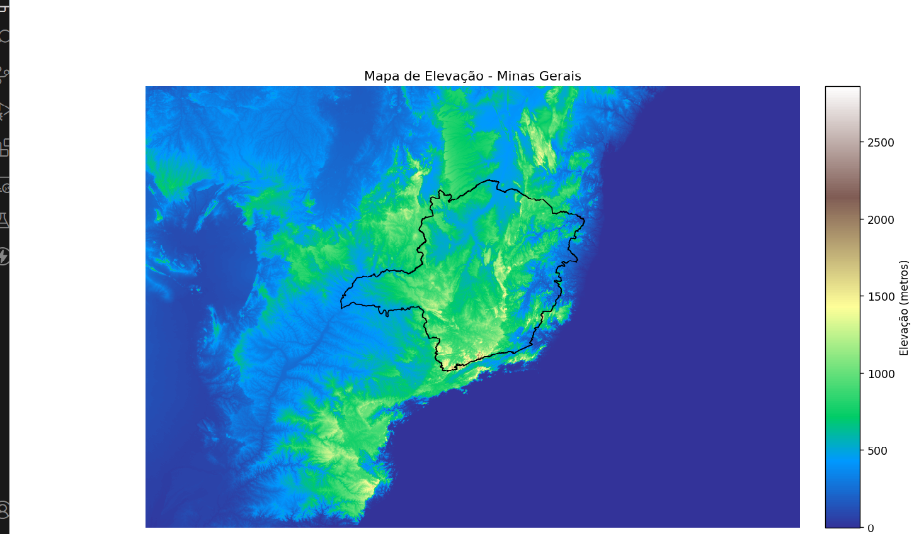

# Minas Gerais Elevation Map

This project generates an elevation map of the state of Minas Gerais, Brazil, using Python. The script utilizes libraries such as `geopandas`, `rasterio`, and `matplotlib` to load and visualize geospatial data.

## Features

- Load geospatial data for Minas Gerais
- Generate an elevation map using raster data
- Visualize the elevation map with matplotlib

## Requirements

- Python 3.x
- Install the dependencies listed in `requirements.txt`:
  ```sh
  pip install -r requirements.txt
  ```

## Installation

1. Clone this repository:
   ```sh
   git clone https://github.com/yourusername/minas-gerais-elevation-map.git
   cd minas-gerais-elevation-map
   ```
2. Install the required dependencies:
   ```sh
   pip install -r requirements.txt
   ```

## Data Acquisition

To generate the elevation map, you will need to download Digital Elevation Model (DEM) data. You can obtain these data from the following sources:

- [USGS Earth Explorer](https://earthexplorer.usgs.gov/): A comprehensive platform for accessing various types of satellite imagery and geospatial data. Register for an account, define your Area of Interest (AOI), and download DEM files from the "SRTM 1 Arc-Second Global" dataset for high-resolution elevation data.

- [NASA Earthdata](https://earthdata.nasa.gov/): Provides access to a wide range of Earth science data, including elevation data from the Shuttle Radar Topography Mission (SRTM).

## Usage

1. Ensure you have the required geospatial data files in the appropriate directories.
2. Run the script to generate the elevation map:
   ```sh
   python generate_elevation_map.py
   ```
3. The script will generate and display an elevation map of Minas Gerais.

## Example

```python
import geopandas as gpd
import rasterio
import matplotlib.pyplot as plt

# Load the geospatial data
shapefile = gpd.read_file('path/to/shapefile.shp')
raster = rasterio.open('path/to/raster.tif')

# Generate and visualize the elevation map
fig, ax = plt.subplots()
shapefile.plot(ax=ax, facecolor='none', edgecolor='black')
ax.imshow(raster.read(1), cmap='terrain', extent=raster.bounds)
plt.title('Elevation Map of Minas Gerais')
plt.xlabel('Longitude')
plt.ylabel('Latitude')
plt.show()
```

## Visualization

Here is a screenshot of the generated elevation map:



## Project Details

This project was created to provide a visual representation of the elevation data for the state of Minas Gerais, Brazil. The main objective was to use Python and various geospatial libraries to process and visualize DEM data. The project involves several key steps:

1. **Data Acquisition**: Obtaining the necessary geospatial data (DEM and shapefiles) from reliable sources such as USGS Earth Explorer and NASA Earthdata.
2. **Data Processing**: Using `geopandas` to load the shapefile of Minas Gerais and `rasterio` to read the DEM data.
3. **Visualization**: Creating an elevation map using `matplotlib` to plot the data and provide a visual representation of the terrain.

This project showcases the application of geospatial data processing and visualization techniques in Python, highlighting the capabilities of libraries such as `geopandas`, `rasterio`, and `matplotlib`.

## Contributing

1. Fork the repository
2. Create your feature branch (`git checkout -b feature/fooBar`)
3. Commit your changes (`git commit -am 'Add some fooBar'`)
4. Push to the branch (`git push origin feature/fooBar`)
5. Create a new Pull Request

## License

This project is licensed under the MIT License - see the [LICENSE](LICENSE) file for details.

## Acknowledgements

- [GeoPandas](https://geopandas.org/)
- [Rasterio](https://rasterio.readthedocs.io/en/latest/)
- [Matplotlib](https://matplotlib.org/)
- [USGS Earth Explorer](https://earthexplorer.usgs.gov/) for providing the DEM data
- [NASA Earthdata](https://earthdata.nasa.gov/) for additional geospatial data
